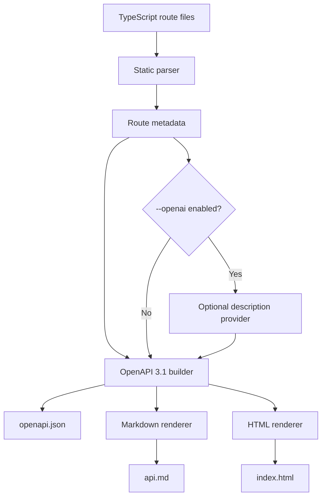

# api-docs-forge

Generate API documentation from TypeScript route code. `api-docs-forge` scans route files, extracts route metadata from common handlers and comments, builds an OpenAPI 3.1 document, and renders Markdown plus standalone HTML from the same source.

It is built for teams that want API docs to stay close to the backend code instead of living in a separate, manually maintained document.

## Who This Is For

- Backend engineers who want generated OpenAPI output from Express-style or Fastify-style route code.
- Platform teams that need repeatable API documentation artifacts in CI.
- Documentation owners who want Markdown and HTML docs generated from the same route metadata.
- API consumers who need a stable `openapi.json` for SDK generation, contract review, testing, or developer portals.

## Real-World Use Cases

- Publish `openapi.json` with each backend release so API consumers can diff contract changes.
- Generate internal Markdown docs for a service catalog or engineering handbook.
- Produce standalone HTML docs for a private portal without adding a hosted docs service.
- Capture request, response, path, query, and header details directly beside the route implementation.
- Add optional generated descriptions only when a local `OPENAI_API_KEY` is available, while keeping deterministic output when it is not.

## How It Works



The parser uses the TypeScript compiler API and `fast-glob` to scan direct files or glob patterns. It ignores `node_modules`, `dist`, and `coverage`.

The parser currently recognizes:

- Express-style route calls such as `router.get("/users/:id", handler)`.
- Static Fastify-style `schema` object literals on route calls.
- Leading JSDoc-style annotations on route calls, functions, classes, methods, or variable declarations.

The OpenAPI builder converts parsed routes into an OpenAPI 3.1 document with `info`, `paths`, operations, parameters, request bodies, and responses. If a route has no response metadata, it emits a deterministic `200` response with `Successful response`.

The renderers consume the OpenAPI document:

- `openapi.json` is stable formatted JSON for tooling.
- `api.md` is GitHub-readable Markdown.
- `index.html` is a standalone static HTML page.

## Setup

Requirements:

- Node.js 20.11 or newer.
- npm.

Install dependencies and build from a checkout:

```bash
npm install
npm run build
```

Run the local CLI after building:

```bash
node dist/cli.js generate "src/**/*.ts" --out docs --title "Billing API" --api-version "1.0.0"
```

When installed as a package, the binary name is `api-docs-forge`:

```bash
npx api-docs-forge generate "src/**/*.ts" --out docs --title "Billing API" --api-version "1.0.0"
```

Generated files:

- `docs/openapi.json`
- `docs/api.md`
- `docs/index.html`

## Safe Environment Configuration

No environment variables are required for deterministic local generation.

Copy `.env.example` to a local ignored file only when you want optional generated descriptions:

```bash
cp .env.example .env.local
```

PowerShell:

```powershell
Copy-Item .env.example .env.local
```

`.env.example` documents the supported optional variables:

```bash
OPENAI_API_KEY=
OPENAI_MODEL=gpt-5.2
```

Keep real keys in `.env.local`, shell profile secrets, CI secrets, or another ignored secret store. Do not commit `.env`, `.env.local`, generated docs containing private API details, or machine-specific workflow notes.

Use generated descriptions only when you explicitly pass `--openai`:

```bash
node dist/cli.js generate "src/**/*.ts" --out docs --openai
```

If `--openai` is enabled but no key is available, the tool falls back to deterministic local descriptions.

## Commands

```bash
npm run lint
npm run typecheck
npm test
npm run build
npm run audit:moderate
npm run check:outdated
```

`npm run audit:moderate` fails on moderate-or-higher known vulnerabilities. `npm run check:outdated` fails when npm reports outdated installed dependencies, which keeps dependency drift visible in CI.

## CLI Reference

```bash
api-docs-forge generate [input...] [options]
```

Options:

- `-o, --out <dir>`: output directory. Defaults to `docs`.
- `--title <title>`: OpenAPI `info.title`. Defaults to `API`.
- `--api-version <version>`: OpenAPI `info.version`. Defaults to `1.0.0`.
- `--description <description>`: OpenAPI `info.description`.
- `--format <formats>`: comma-separated output formats: `openapi`, `markdown`, `html`.
- `--openai`: fill missing descriptions through the optional description provider.
- `--openai-model <model>`: model name for optional generated descriptions.

Examples:

```bash
api-docs-forge generate "src/routes/**/*.ts" --out docs
api-docs-forge generate src/routes/users.ts src/routes/billing.ts --format openapi,markdown
api-docs-forge generate "services/**/*.ts" --title "Platform API" --api-version "2026.05"
```

## Library Usage

```ts
import { buildOpenApiDocument, parseProjectRoutes, renderMarkdown } from "api-docs-forge";

const routes = await parseProjectRoutes(["src/**/*.ts"]);
const document = buildOpenApiDocument(routes, {
  title: "Billing API",
  version: "1.0.0"
});

const markdown = renderMarkdown(document);
```

For end-to-end generation from code to files:

```ts
import { generateApiDocs } from "api-docs-forge";

await generateApiDocs({
  input: ["src/**/*.ts"],
  outDir: "docs",
  title: "Billing API",
  version: "1.0.0",
  formats: ["openapi", "markdown", "html"]
});
```

## Route Metadata

Annotated handler:

```ts
/**
 * @api POST /invoices
 * @summary Create invoice
 * @tag Invoices
 * @requestBody application/json {"type":"object","required":["amount"],"properties":{"amount":{"type":"number"}}}
 * @response 201 Created {"type":"object","required":["id"],"properties":{"id":{"type":"string"}}}
 */
export async function createInvoice() {}
```

Annotated route call:

```ts
/**
 * @summary List users
 * @tag Users
 * @query search string optional Search text
 * @response 200 List of users {"type":"array","items":{"type":"object"}}
 */
router.get("/users", listUsers);
```

Fastify-style static schema:

```ts
fastify.get("/reports/:id", {
  schema: {
    summary: "Fetch report",
    tags: ["Reports"],
    params: {
      type: "object",
      required: ["id"],
      properties: { id: { type: "string" } }
    },
    response: {
      200: {
        type: "object",
        properties: { id: { type: "string" } }
      }
    }
  }
}, async () => {});
```

Supported annotation tags include `@api`, `@route`, `@summary`, `@description`, `@tag`, `@tags`, `@operationId`, `@param`, `@query`, `@path`, `@header`, `@requestBody`, `@body`, and `@response`.

## Codebase Structure

```text
src/
  annotations.ts   Parses JSDoc-style route metadata.
  cli.ts           Commander-based CLI entrypoint.
  descriptions.ts  Optional OpenAI description provider plus local fallback.
  generator.ts     End-to-end docs generation and file writing.
  index.ts         Public library exports.
  openapi.ts       OpenAPI 3.1 document builder.
  parser.ts        TypeScript AST and glob-based route discovery.
  renderers.ts     Markdown and HTML renderers.
  schema.ts        Fastify-style schema extraction.
  types.ts         Public TypeScript types.
  utils.ts         Normalization and stable JSON helpers.
test/
  *.test.ts        Parser, OpenAPI, renderer, and description tests.
.github/
  workflows/ci.yml CI validation for install, audit, freshness, lint, types, tests, and build.
  dependabot.yml   Weekly npm and GitHub Actions update checks.
```

## Privacy And Security Notes

- Source files are parsed locally from the paths you provide.
- The default generation path does not call an external service.
- The optional OpenAI path is only used when `--openai` is passed and an API key is available.
- The OpenAI description provider sends route metadata, not full source files, but route names, paths, parameters, tags, and response status codes may still be sensitive.
- Review generated docs before publishing if your route paths, descriptions, or schemas reveal internal systems.
- Keep generated docs out of version control unless they are intended to be public artifacts.
- Dependabot is configured for npm packages and GitHub Actions; CI also runs npm audit and outdated checks.

## Development Workflow

Before opening a pull request or publishing a release, run:

```bash
npm install
npm run lint
npm run typecheck
npm test
npm run build
npm run audit:moderate
npm run check:outdated
git diff --check
```

Only `README.md` is tracked as project Markdown. Keep private notes, local handoff files, environment files, and generated workflow logs outside version control.
