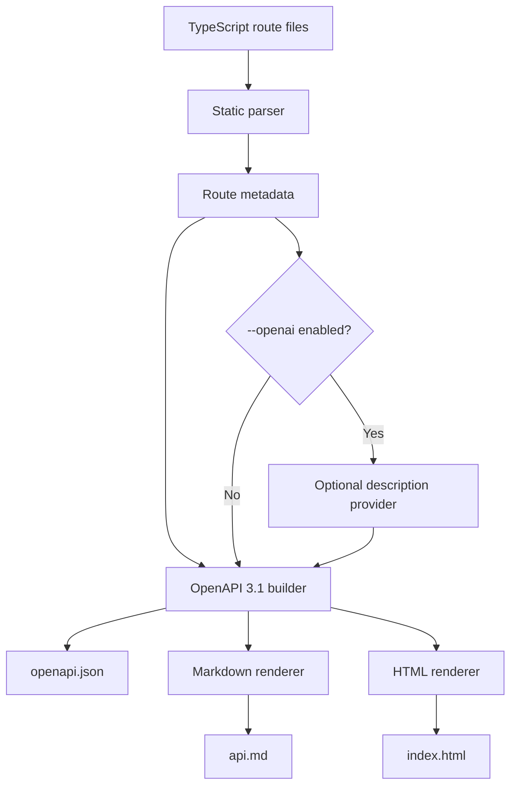

# Architecture

`api-docs-forge` parses TypeScript route files, builds one OpenAPI 3.1 document, and renders every output format from that document.

## Pipeline

Diagram source: [architecture.mmd](architecture.mmd).

The parser uses the TypeScript compiler API and `fast-glob` to scan direct files or glob patterns. It ignores `node_modules`, `dist`, and `coverage`.

The parser currently recognizes:

- Express-style route calls such as `router.get("/users/:id", handler)`.
- Static Fastify-style `schema` object literals on route calls.
- Leading JSDoc-style annotations on route calls, functions, classes, methods, or variable declarations.

The OpenAPI builder converts parsed routes into an OpenAPI 3.1 document with `info`, `paths`, operations, parameters, request bodies, and responses. If a route has no response metadata, it emits a deterministic `200` response with `Successful response`.

The renderers consume the OpenAPI document:

- `openapi.json` is stable formatted JSON for tooling.
- `api.md` is GitHub-readable Markdown.
- `index.html` is a standalone static HTML page.

## Source modules

| File | Role |
| --- | --- |
| `src/annotations.ts` | Parses JSDoc-style route metadata. |
| `src/cli.ts` | Commander-based CLI entrypoint. |
| `src/descriptions.ts` | Optional OpenAI description provider plus local fallback. |
| `src/generator.ts` | End-to-end docs generation and file writing. |
| `src/index.ts` | Public library exports. |
| `src/openapi.ts` | OpenAPI 3.1 document builder. |
| `src/parser.ts` | TypeScript AST and glob-based route discovery. |
| `src/renderers.ts` | Markdown and HTML renderers. |
| `src/schema.ts` | Fastify-style schema extraction. |
| `src/types.ts` | Public TypeScript types. |
| `src/utils.ts` | Normalization and stable JSON helpers. |
| `test/*.test.ts` | Parser, OpenAPI, renderer, and description tests. |
| `.github/workflows/ci.yml` | CI validation for install, audit, freshness, lint, types, tests, and build. |
| `.github/dependabot.yml` | Weekly npm and GitHub Actions update checks. |

## Who this is for

- Backend engineers who want generated OpenAPI output from Express-style or Fastify-style route code.
- Platform teams that need repeatable API documentation artifacts in CI.
- Documentation owners who want Markdown and HTML docs generated from the same route metadata.
- API consumers who need a stable `openapi.json` for SDK generation, contract review, testing, or developer portals.

## Real-world use cases

- Publish `openapi.json` with each backend release so API consumers can diff contract changes.
- Generate internal Markdown docs for a service catalog or engineering handbook.
- Produce standalone HTML docs for a private portal without adding a hosted docs service.
- Capture request, response, path, query, and header details directly beside the route implementation.
- Add optional generated descriptions only when a local `OPENAI_API_KEY` is available, while keeping deterministic output when it is not.
